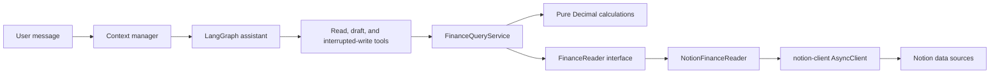

# Architecture walkthrough

The project is organized so financial decisions remain testable without Notion or an LLM.



## `domain/`

The innermost layer. It contains plain objects such as `Transaction`, `Income`, `Budget`, and
`PlannedExpense`, plus Decimal-safe money helpers. It imports no Notion, LangGraph, or tool
code. A `Transaction.final_amount` always means Notion's `Final` value.

## `integrations/`

Code that understands an external system.

- `notion.py` wraps the async Python `notion-client` SDK and owns pagination.
- `notion_schema.py` records case-sensitive property mappings. Source IDs come from settings.
- `notion_finance.py` converts Notion page dictionaries into domain objects immediately.
- `notion_profile.py` maps compact profile entries and creates append-versioned pages.

If Notion changes its response shape, this is the main layer that changes. Finance formulas
should not change.

## `services/`

There are two deliberately different kinds of service code.

- `calculations.py` is pure and deterministic. It accepts normal objects and returns normal
  dataclasses. It performs no network calls.
- `finance_queries.py` is an application service. It decides which date range to load, asks a
  `FinanceReader` for data, and calls the pure function that answers the use case.
- `ports.py` defines the small `FinanceReader` interface. Tests replace Notion with an
  in-memory reader.
- `profile.py` validates stable keys, detects stale drafts, and coordinates profile versions.
- `interaction.py` compiles controlled conversation defaults/overrides and maps changes back to
  the same versioned profile service.
- `budget_planning.py` loads grounded planning evidence and validates an agent-designed plan;
  it does not choose categories or allocations for the model.

Example request path:

```text
get_budget_status("2026-08")
  → FinanceQueryService loads August transactions and budgets
  → budget_status(transactions, budgets, August)
  → a Decimal-safe MonthlyBudgetStatus result
```

Budget membership is also the deterministic classification rule: an exact monthly budget
match makes a sub-category `regular`; no match makes it `variable`. `Progressive` controls
forecast behavior, and `Volatility` controls how much positive remaining budget is considered
adjustable. These meanings live in calculations rather than prompts.

## `tools/`

Tools are narrow adapters between the model's JSON arguments and application services.

- `read/` exposes factual queries.
- `draft/` exposes proposals that do not persist anything.
- `write/` contains only tools that call `interrupt()` before performing a mutation.
- `serialization.py` turns dataclasses, dates, and Decimals into compact JSON-safe results.
- `registry.py` assembles exactly the tools allowed in a graph.

The registry is a safety and composition boundary—not a place for calculations. It exposes a
safe catalog and an approval-aware catalog. The latter includes the profile write tool, whose
side effect is unreachable until the thread is resumed with approval.

Monthly budget creation follows the same composition rule. A read tool loads prior/target
context, a draft tool validates the model's plan without writing, and the apply tool interrupts
before the Notion creation repository becomes reachable.

## `graphs/`

`conversation.py` contains one LangGraph with three nodes:

```text
manage context → assistant → optional tool execution → assistant → end
```

The checkpointer stores message state under `configurable.thread_id`. Reusing a thread ID
continues that conversation; a different ID starts isolated state. The context node refreshes
Active Notion profile entries, separates interaction settings from financial rules, and
summarizes/removes older messages when the configured token threshold is reached. The graph
factory accepts the chat model and checkpointer rather than selecting vendors itself.

`daily_budget.py` and `expense_monitor.py` are separate top-level workflows. The expense graph
starts from an event rather than a message, loads only affected finance months, and persists
idempotency/snapshot/alert state in its own SQLite operational ledger. It shares pure finance
services and Notion readers with the other graphs, but not message state or failures.

```text
expense event → page snapshot diff → monthly inputs → deterministic impact
              → severity/dedup → optional draft → decision + outbox commit
```

The conversation graph accesses a monitoring decision only when needed through the read-only
`get_expense_monitoring_decisions` tool. Monitor state is never copied into the normal prompt.

## `bootstrap.py`

The composition root is where abstract layers become a running application:

```text
Settings
  → real notion-client adapter
  → Notion finance reader
  → finance query service
  → separated tool registry
  → context-managed graph
```

This is the only normal location that constructs the real Notion dependency chain. The API
layer will later own this container's startup and shutdown lifetime.

## Why this separation matters

- A model cannot silently redefine a financial formula.
- Calculation tests need no network or API keys.
- Notion payloads do not enter graph state, reducing context size.
- A draft can be reviewed without granting write capability.
- A durable preference write is append-versioned and must cross a mandatory approval interrupt.
