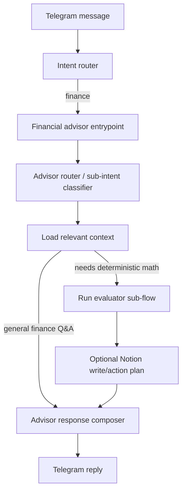

# Financial Advisor Capability Plan

## Goal

Give the personal assistant a professional financial-advisor capability inside the existing main Telegram channel. The assistant should recognize finance-related user intent from context, load the right financial data, run deterministic planning logic, and respond with practical guidance.

This should not be a separate Telegram channel. It should be a skill/capability used by the main assistant whenever the user is asking about expenses, income, balance, budget, future purchases, spending desires, affordability, saving, or investing readiness.

The core idea:

- The LLM understands the user's message and explains the result.
- Deterministic tools and graph nodes calculate financial recommendations when a request needs math or persistence.
- Notion remains the source of truth for expenses, income, budgets, future purchases, and future vacations. Local advisor memory stores the current bank balance and emergency-fund policy.

## Current Repo Starting Point

The repo already has useful financial foundations:

- `router/intent_router.py` classifies finance and budget messages.
- `agent/contexts/financial_context.py` defines finance behavior and tool policy.
- `tools/notion_tools.py` provides Notion querying, page creation, database schema access, expense retrieval, income retrieval, spending habits, and persisted financial advisor habits.
- `tools/budget_tools.py` has monthly budget planning utilities.
- `tools/monthly_budget/` has a newer budget engine for expense classification, income prediction, budget allocation, forecasting, and budget monitoring.
- `tools/registry.py` registers finance, budget, Notion, and market tools.
- Tests already exist around general agent behavior, monthly budget engine behavior, Notion budget writing, monitors, and expense automations.

The new capability should build on this instead of replacing it.

## Product Behavior

The assistant should support these user-facing flows:

1. Expense analysis
   - "How am I doing this month?"
   - "Why is food so high?"
   - "Show me the expensive transactions from last week."
   - "Can I spend another 300 ILS this weekend?"

2. Desire capture and affordability
   - "I want to buy a new MacBook."
   - "I kind of want a new guitar."
   - "Can I afford a trip in September?"
   - "Remind me later if this is not smart right now."

3. Monthly budget advice
   - "Should I update my restaurant budget?"
   - "What should my budget be for August?"
   - "How much can I spend on hobbies this month?"
   - "Am I on track?"

4. Future purchase and obligation planning
   - "I need to pay 1800 ILS for car license every April."
   - "Tuition payment is due in October."
   - "I have a yearly subscription in December."
   - The assistant should plan ahead by spreading the expected cost across earlier months.

5. Income and balance advice
   - "My balance is 35,000 ILS."
   - "My salary this month is updated."
   - "Do I have enough emergency fund?"
   - "Should I move extra money to savings or investments?"

6. Financial policy memory
   - "I want at least 3 months of budget available in my bank account."
   - "Do not let hobbies exceed 8% of income."
   - "If balance exceeds the emergency fund by more than 5,000 ILS, suggest savings."
   - These rules should be persisted, not rediscovered each time.

## Non-Goals and Boundaries

This capability should not pretend to be a licensed investment advisor. It can:

- analyze the user's own data,
- compare spending to the user's own baseline,
- budget for obligations,
- suggest that excess cash can be moved to savings or considered for investment,
- help prepare a decision.

It should not:

- guarantee investment returns,
- recommend specific securities as a definitive instruction,
- make irreversible financial decisions without explicit confirmation,
- invent missing bank balances or income,
- fabricate Notion rows or expenses.

For investment-related language, use a careful frame:

- "You have extra cash beyond your emergency target. Reasonable options are..."
- "If you want, we can compare savings, emergency fund, and investment allocation."
- Avoid "buy X stock now" as a command.

## Architecture Overview

Add a new financial advisor capability graph that sits behind the main assistant's finance intent.



This is a capability graph, not one fixed deterministic workflow. It can answer broad finance questions, route into deterministic sub-flows, or persist low-risk records depending on the request. The LLM can classify sub-intent, decide which path is relevant, and compose responses, but financial calculations should live in normal Python functions.

Recommended files:

- `agent/financial_advisor_graph.py`
- `agent/contexts/financial_advisor_context.py`
- `tools/financial_advisor/`
- `tests/test_financial_advisor_graph.py`
- `tests/test_financial_advisor_engine.py`
- `docs/financial_advisor_capability_plan.md`

## Financial Advisor Capability Graph

Create a graph with these nodes:

1. `advisor_router`
   - Input: user text, current date, active session memory.
   - Output: structured routing JSON with sub-intent, route category, context needs, and extracted entities.
   - Sub-intents:
     - `general_finance_question`
     - `expense_summary`
     - `expense_drilldown`
     - `transaction_lookup`
     - `desire_affordability`
     - `desire_capture`
     - `monthly_budget_advice`
     - `future_obligation_capture`
     - `future_obligation_review`
     - `balance_update`
     - `income_review`
     - `emergency_fund_check`
     - `savings_or_investing_readiness`
     - `advisor_rule_update`
     - `clarify`
   - Route categories:
     - `deterministic_evaluation`
     - `contextual_answer`
     - `clarify`
   - Context needs:
     - `rules`
     - `budget`
     - `expenses`
     - `income`
     - `balance`
     - `obligations`
     - `future_purchases`
     - `future_vacations`
   - Extracted entity keys:
     - `desire`
     - `balance_snapshot`
     - `obligation`
     - `rule`
   - Use an LLM-assisted structured router in production, with deterministic heuristic fallback for reliability and tests.

2. `load_context`
   - Load only the data declared in `context_needs`.
   - Do not rely on hardcoded sub-intent-to-tool loading except as a fallback.
   - Common context includes:
     - financial advisor rules,
     - current or requested month budget,
     - latest account balance snapshot,
     - income,
     - expenses,
     - obligations,
     - future purchases and vacations.
   - Do not re-fetch the same data within one turn.

3. `evaluate`
   - Run deterministic calculations:
     - affordability,
     - projected month-end spend,
     - remaining budget,
     - emergency fund gap,
     - future obligation monthly reserve,
     - future purchase priority score,
     - savings/investing readiness.

4. `plan_writes`
   - Decide whether a Notion write is needed.
   - For low-risk writes, perform immediately:
     - log a future purchase,
     - update local bank balance memory when user explicitly provides balance,
     - create a future obligation when user explicitly gives all required details.
   - For higher-impact writes, ask for confirmation:
     - updating a monthly budget,
     - archiving old obligations,
     - marking a future purchase as approved/purchased,
     - changing emergency fund policy.

5. `advisor_agent_response`
   - Compose a concise answer using the calculation result.
   - Include exact numbers and a recommended next action.
   - If data is missing, say exactly what is missing.
   - For general finance questions, answer from loaded context and clearly state which data was available or missing.

## State Model

Create a typed state similar to the existing budget graph:

```python
class FinancialAdvisorState(TypedDict):
    messages: list[BaseMessage]
    user_text: str
    sub_intent: str
    period: dict[str, str]
    loaded_context: dict[str, Any]
    evaluation: dict[str, Any]
    write_plan: dict[str, Any]
    response: str
    needs_confirmation: bool
```

Keep state explicit. The assistant should never rely on hidden conversational vibes for money logic.

## Notion And Memory Schema

Use Tal's actual Notion setup rather than creating a parallel finance system.

### Existing Databases

Keep using:

- `expenses`: all expenses paid by credit card, gift card, or bank account. The ID is already available from `.env`.
- `income`: all income that reaches the bank account. The ID is already available from `.env`.
- `budget`: Notion database `33704cdbba51802dac8ac42b4356bdad`.
- `financial_summary`: Notion database `1cf04cdbba518006ac13cde3cf92e363`.
- `future_purchases`: Notion database `2db04cdbba5180729bbbd6af0f87ec1e`.
- `future_vacations`: Notion database `32d04cdbba51801b9a0efcd1cbd61f8a`.
- local advisor memory under `budget_data/financial_advisor_profile.json`.

### Budget DB

Purpose: hold one row per predictable expense sub-category that should be monitored.

Rules:

- Each row name must exactly match the expense sub-category name.
- The `Budget` property holds the desired monthly budget.
- The row must relate to the correct month in `Financial Summary`.
- Predictable sub-categories like groceries, bills, rent, subscriptions, and recurring car costs belong here.
- Unpredictable purchases like impulse buys or one-off clothing purchases should not get dedicated recurring budget rows.

Live properties:

| Property | Type | Purpose |
|---|---|---|
| Name | title | Exact expense sub-category name |
| Budget | number | Desired monthly budget in ILS |
| Date | date | Budget month |
| Financial Summary | relation | Matching Financial Summary month |

### Financial Summary DB

Purpose: monthly roll-up page that relates budget rows, expenses, and income.

Live properties include:

| Property | Type | Purpose |
|---|---|---|
| Name | title | Month name |
| Date | date | Month date |
| Budget | number | Monthly budget total |
| Budget DB | relation | Related budget rows |
| Income Database | relation | Related income rows |
| 💳 Expenses Database | relation | Related expense rows |

### Future Purchases DB

Purpose: hold products Tal wants to buy later when they are not financially smart right now.

Live properties:

| Property | Type | Purpose |
|---|---|---|
| Name | title | Product/purchase name |
| Budget | number | Estimated cost in ILS |
| Priority | select | Priority marker, currently `🚩` |
| Reason | rich_text | Why Tal wants it |
| Notes | rich_text | Assistant affordability/saving notes |
| URL | url | Optional product URL |
| Tag | multi_select | Optional tags |

When Tal discusses a product:

1. Evaluate whether it is affordable now.
2. If not recommended, create a Future Purchases row.
3. If Tal asks what future purchases exist, list this DB.
4. If Tal wants to save for one, build a saving plan from income, expenses, budget, bank balance, and the emergency buffer.

### Future Vacations DB

Purpose: hold future vacation/travel goals.

Live properties:

| Property | Type | Purpose |
|---|---|---|
| Country | title | Destination |
| Budget | number | Estimated vacation budget in ILS |
| Travel Dates | date | Planned travel date range |
| Activities | multi_select | Planned activities |

### Local Financial Advisor Memory

Purpose: remember finance policy and values that are not direct Notion rows.

Current local memory file:

- `budget_data/financial_advisor_profile.json`

Stores:

- current bank account balance,
- balance currency,
- balance update date,
- emergency fund policy, defaulting to 3 months of expenses.

The assistant should use the remembered bank balance for affordability and saving plans. If Tal says "my bank balance is 10,000 ILS", update this local memory immediately.

## Tool Layer

Create a new package:

```text
tools/financial_advisor/
    __init__.py
    models.py
    notion_tools.py
    engine.py
    formatting.py
```

### Data Tools

Add tools for reading financial data:

- `get_expense_summary(start_date, end_date)`
- `get_transactions(start_date, end_date, category=None, sub_category=None, min_amount=None)`
- `get_income_summary(start_date, end_date)`
- `get_current_bank_balance()`
- `get_current_budget(month="")`
- `get_future_purchases(min_budget=None)`
- `get_future_vacations()`
- `get_financial_profile()`

Add tools for writing financial data:

- `create_future_purchase(...)`
- `create_future_vacation(...)`
- `update_bank_account_balance(balance, currency="ILS", notes="")`
- `update_emergency_fund_months(months)`
- `log_financial_recommendation(...)`
- `update_financial_advisor_rule(rule)`

The tool layer should return simplified dictionaries, not raw Notion responses, unless debugging.

### Engine Functions

The deterministic engine should be normal Python functions, not LangChain tools:

- `calculate_monthly_cashflow(income, expenses, budget, obligations)`
- `calculate_emergency_fund_target(monthly_budget, months=3)`
- `evaluate_emergency_fund(balance, monthly_budget, required_months)`
- `calculate_available_surplus(balance, emergency_target, upcoming_reserves)`
- `calculate_future_obligation_reserve(obligation, today)`
- `score_desire(desire, affordability_result)`
- `evaluate_desire_affordability(desire, context)`
- `recommend_budget_adjustments(expense_patterns, current_budget, obligations)`
- `project_month_end_spending(expenses_so_far, historical_patterns, today)`
- `detect_spending_pattern_changes(current_period, historical_baseline)`

These functions should be easy to unit test with plain dicts or dataclasses.

## Financial Decision Rules

### Emergency Fund

Default policy:

```text
emergency_target = current_monthly_budget * 3
```

The user can update this rule:

- "I want 4 months of budget as emergency fund."
- "I only need 2 months while I am studying."

Decision:

- If latest liquid balance < target:
  - recommend not making non-essential purchases,
  - suggest how much is missing,
  - optionally create a saving target.
- If latest liquid balance >= target:
  - calculate surplus.
- If surplus is meaningful:
  - suggest saving toward future purchases/vacations, or reviewing investment readiness.

### Affordability

For a desire or purchase, calculate:

```text
available_after_emergency = latest_liquid_balance - emergency_target
month_remaining_budget = planned_month_budget - month_to_date_spending - required_obligation_reserves
```

Result levels:

- `affordable_now`
  - purchase does not break emergency fund,
  - purchase does not break current month budget,
  - no critical near-term obligation is underfunded.
- `affordable_with_plan`
  - not smart today,
  - can be funded over a clear number of months.
- `not_recommended`
  - would break emergency fund,
  - would consume money needed for mandatory obligations,
  - or desire score is low and cost is high.
- `needs_more_info`
  - missing estimated cost, balance, income, or target date.

### Future Purchases And Vacations

Future purchases and vacations are goals, not recurring budget rows.

For each product/vacation goal:

1. Check the current bank balance against the emergency target.
2. If bank balance is below target, advise rebuilding the bank buffer first.
3. If bank balance is above target, calculate surplus after the emergency buffer.
4. Compare surplus and monthly cashflow to the goal budget.
5. Recommend a saving plan only after the emergency target is protected.

Example:

- Monthly expense/budget baseline: 7,000 ILS.
- Emergency rule: 3 months.
- Bank target: 21,000 ILS.
- Current bank balance: 10,000 ILS.
- Recommendation: first save 11,000 ILS to restore the bank buffer, then start saving toward the camera/trip.

### Monthly Budget

Budget recommendations should use:

- predicted income,
- existing monthly budget pages,
- historical category behavior,
- current month spending pace,
- active future obligation reserves,
- emergency fund status,
- user rules.

The assistant should distinguish:

- recurring fixed expenses,
- predictable variable expenses,
- non-predictable discretionary expenses,
- future purchase/vacation savings.

When money is tight, order of priority:

1. Mandatory obligations.
2. Essential recurring expenses.
3. Emergency fund gap.
4. Predictable living expenses.
5. Desire savings.
6. Fun/discretionary spending.
7. Investing.

### Human-In-The-Loop Budget Maintenance

The assistant should support conversational budget maintenance without forcing Tal into the full monthly budget workflow every time.

Tools:

- `preview_monthly_budget_plan(...)`
  - Builds a deterministic next-month budget proposal.
  - Does not write to Notion.
  - Defaults to next month.
- `apply_monthly_budget_plan(..., approved=True)`
  - Creates or updates Budget rows in Notion from the deterministic preview.
  - Must only be called after explicit approval.
  - The `approved` flag is a hard write gate.
- `review_monthly_budget_status(month="", as_of="")`
  - Compares Budget rows against month-to-date spending.
  - Shows over-budget and projected-over-budget categories.
- `set_monthly_budget(sub_category, budget, month="")`
  - Creates or updates one Budget row.
  - Use when Tal explicitly adjusts a category.
- Existing tools still available:
  - `review_monthly_budgets`
  - `update_monthly_budget`
  - `delete_monthly_budget`

Intended conversational loop:

1. Near month end, Tal asks to prepare next month.
2. Assistant calls `preview_monthly_budget_plan`.
3. Assistant explains the proposal and asks for approval or changes.
4. If Tal approves, assistant calls `apply_monthly_budget_plan(..., approved=True)`.
5. During the month, Tal can ask "am I overspending?" and the assistant calls `review_monthly_budget_status`.
6. If Tal chooses to adjust, assistant calls `set_monthly_budget` for the relevant sub-category.

### Product Purchase Handling

When the user mentions a product they want to buy:

1. Extract:
   - name,
   - estimated cost if present,
   - category,
   - target date/time horizon,
   - priority/urgency if expressed,
   - reason,
   - necessity.
2. If cost is missing, ask one focused question or store with missing cost.
3. Evaluate affordability if enough data exists.
4. If the purchase is not recommended now, create a `future_purchases` page.
5. Store assistant notes explaining the affordability decision and saving order.
6. Store assistant notes explaining the decision.
7. Respond with:
   - can/cannot afford now,
   - why,
   - when it may become reasonable,
   - whether it was saved to Future Purchases.

If the user clearly says "just save this purchase", skip affordability analysis unless easy context is already available.

## Intent and Routing

Update `router/intent_router.py`:

- Keep `budget` for explicit monthly budget planning workflow.
- Route the following to `finance`:
  - afford/can I buy,
  - desire/want to buy,
  - bank balance,
  - emergency fund,
  - future payment,
  - subscription renewal,
  - yearly cost,
  - savings/investment readiness,
  - spending patterns.

Then inside finance, use `financial_advisor_graph.py` to classify sub-intent and route to the right advisor sub-flow.

Example fast-path regexes:

```python
_DESIRE_RE = re.compile(r"\b(i want|want to buy|thinking of buying|dreaming of|wish i had)\b", re.I)
_AFFORD_RE = re.compile(r"\b(can i afford|should i buy|is it smart to buy)\b", re.I)
_BALANCE_RE = re.compile(r"\b(balance|bank account|checking account|cash available)\b", re.I)
_OBLIGATION_RE = re.compile(r"\b(yearly|annual|renewal|license|tuition|insurance|due in)\b", re.I)
_EMERGENCY_RE = re.compile(r"\b(emergency fund|months of budget|safety net)\b", re.I)
```

## Prompt/Context Updates

Create `agent/contexts/financial_advisor_context.py`.

The prompt should say:

- Use tools before answering money questions.
- Never invent expenses, income, balances, or budgets.
- Use deterministic evaluator outputs as the source of truth.
- Compare Tal to Tal's own data, not generic advice.
- Ask at most one focused question if a key value is missing.
- For wanted products, save to Future Purchases when not immediately approved.
- For future vacations, read the Future Vacations DB and build saving plans when asked.
- Always mention emergency fund impact for meaningful purchases.
- Keep answers concise, with exact ILS numbers.

Example response shape:

```text
Short answer: not yet.

The MacBook is around 9,000 ILS. Your emergency target is 30,000 ILS and your latest balance is 33,500 ILS, so only 3,500 ILS is safely free right now. Buying it today would push you below the safety buffer.

I saved it to Future Purchases. A reasonable plan starts after the bank buffer is fully funded.
```

## Main Assistant Integration

Implementation options:

1. Simple v1
   - Keep the existing `finance` context.
   - Add the new financial advisor tools to `tools/registry.py`.
   - Strengthen `FINANCIAL_CONTEXT`.
   - Let the existing general agent call tools directly.

2. Recommended v2
   - Add an explicit `financial_advisor_graph.py`.
   - When `classify_intent(...) == "finance"`, run the financial advisor graph instead of plain general-agent finance context.
   - Keep the existing general agent for broad conversation and simple tool use.

Recommended: implement v1 only if you want speed. For a professional capability, implement v2.

## Deterministic Sub-Flow Examples

### Example 1: Desire

User:

```text
I want to buy a new guitar, probably around 4500 ILS.
```

Flow:

1. Intent router returns `finance`.
2. Financial advisor sub-intent returns `desire_affordability`.
3. Load:
   - latest balance,
   - current monthly budget,
   - current month expenses,
   - income,
   - future obligations,
   - advisor rules.
4. Evaluate affordability.
5. Create desire row if not obviously approved.
6. Respond with decision and saving plan.

### Example 2: Future Obligation

User:

```text
Every April I need to pay 1800 ILS for the car license.
```

Flow:

1. Sub-intent: `future_obligation_capture`.
2. Extract:
   - name: Car license,
   - amount: 1800,
   - recurrence: Yearly,
   - due month: April.
3. If exact due date is missing, use April 1 or ask for date depending on desired precision.
4. Create future obligation.
5. Recalculate monthly reserve.
6. Respond with monthly reserve impact.

### Example 3: Balance Update

User:

```text
My bank balance is 42,300 ILS.
```

Flow:

1. Sub-intent: `balance_update`.
2. Create account balance snapshot.
3. Load current budget and emergency rule.
4. Evaluate surplus/gap.
5. Respond:
   - emergency target,
   - surplus,
   - suggested allocation.

## Implementation Milestones

### Milestone 1: Data Model and Notion Setup

1. Create Notion databases:
   - Financial Desires,
   - Future Financial Obligations,
   - Account Balance Snapshots,
   - optionally Financial Recommendations.
2. Add database IDs to `notion_config/databases.json`.
3. Add property schemas under `notion_config/properties/`.
4. Add environment documentation to `README.md`.

Done when:

- local config can resolve all new logical DB names,
- `get_database_schema("financial_desires")` works,
- a test can create normalized Notion properties for each DB.

### Milestone 2: Financial Advisor Engine

1. Create `tools/financial_advisor/models.py`.
2. Create `tools/financial_advisor/engine.py`.
3. Implement pure functions for:
   - emergency target,
   - surplus,
   - future reserve,
   - affordability,
   - desire scoring,
   - budget adjustment recommendation.
4. Add unit tests with no Notion dependency.

Done when:

- tests cover affordable now,
- affordable with plan,
- not recommended,
- missing balance,
- future annual obligation reserve,
- emergency fund gap.

### Milestone 3: Notion Tools

1. Create `tools/financial_advisor/notion_tools.py`.
2. Add read/write helpers using `NotionConfigLoader` and existing Notion normalization style.
3. Return simplified objects.
4. Register tools in `tools/registry.py`.

Done when:

- tools can query desires,
- create a desire,
- create an obligation,
- create a balance snapshot,
- fetch latest balance.

### Milestone 4: Financial Advisor Capability Graph

1. Create `agent/financial_advisor_graph.py`.
2. Add typed state.
3. Implement nodes:
   - advisor router with structured output and heuristic fallback,
   - load context,
   - evaluate,
   - plan writes,
   - advisor response.
4. Keep all calculations in engine functions.
5. Add tests with fake data providers.

Done when:

- a desire message creates the expected write plan,
- a balance update creates a snapshot plan,
- a future obligation message creates an obligation plan,
- an expense summary does not write anything.
- a general finance question can answer from loaded context without forcing an affordability/budget-write pipeline.
- ambiguous finance messages can be routed by the LLM into the correct context and sub-flow.

### Milestone 5: Routing Integration

1. Update `router/intent_router.py` fast paths.
2. Update Telegram main handler flow so finance intent can call the financial advisor graph.
3. Route budget planning/review language into the finance capability, not the removed deterministic budget workflow.
4. Add fallback to existing general agent if graph cannot classify.

Done when:

- "Can I afford..." enters financial advisor,
- "Start monthly budget" enters the finance capability and uses budget tools,
- "Show my spending this week" enters financial advisor,
- non-finance messages are unaffected.

### Milestone 6: Response Quality and Guardrails

1. Add financial advisor context prompt.
2. Add response formatting helpers.
3. Make missing data messages explicit.
4. Add confirmation rules for budget-changing writes.
5. Add recommendation logging if desired.

Done when:

- responses are short,
- numbers are exact,
- missing data is named,
- the assistant does not claim certainty when balance/income is stale.

### Milestone 7: Automations and Monitors

Add scheduled checks later, after the interactive feature works:

- monthly obligation reserve review,
- budget drift monitor,
- emergency fund surplus/gap monitor,
- desires review once per month,
- stale balance reminder.

Possible automation messages:

- "Your balance snapshot is 18 days old. Update it before I judge your guitar dreams."
- "April car license is 3 months away. Reserve 600 ILS/month."
- "You are 2,400 ILS above your emergency target. Consider moving part of it to savings."

## Testing Plan

### Unit Tests

Create `tests/test_financial_advisor_engine.py`.

Test:

- emergency fund target with default 3 months,
- custom emergency fund months,
- surplus calculation,
- annual obligation reserve,
- desire scoring,
- desire not recommended when it breaks emergency fund,
- desire affordable with saving plan,
- no recommendation when required data is missing.

### Capability Graph Tests

Create `tests/test_financial_advisor_graph.py`.

Use fake loaders/tools. Test:

- desire capture path,
- future obligation capture path,
- balance update path,
- emergency fund check path,
- monthly budget advice path,
- clarification when cost/date is missing.

### Router Tests

Extend router tests or add new ones.

Test:

- "Can I afford a MacBook?" -> finance.
- "I want to buy a guitar" -> finance.
- "My bank balance is 42000" -> finance.
- "Every April I pay car license" -> finance.
- "Start monthly budget" -> budget.

### Integration Tests

Use mocked Notion client:

- create desire page properties are correctly normalized,
- create obligation properties are correctly normalized,
- latest balance query sorts by date descending,
- future obligations filter only active items.

## Development Order

Recommended order:

1. Add Notion databases and config.
2. Build pure financial advisor engine.
3. Add tests for the engine.
4. Build Notion read/write tools.
5. Register tools.
6. Build financial advisor graph.
7. Update routing.
8. Update prompt/context.
9. Add capability graph tests.
10. Add automations.

Do not start with the LLM prompt. Start with the data model and deterministic engine. The prompt should explain and orchestrate, not become the financial system.

## Open Decisions

These choices can be made later without blocking the implementation:

1. Should `financial_recommendations` be required in v1, or only added once recommendations become noisy?
2. Should desire cost be required before creating a desire, or can desires exist with missing estimated cost?
3. Should future obligations use exact dates only, or allow month-only entries such as "April"?
4. Which balance accounts count toward emergency fund?
   - Main checking only?
   - Checking + savings?
   - Exclude investments?
5. Should savings goals be part of `financial_desires`, or a separate database?
6. What is the default emergency fund rule?
   - Current request says at least 3 months of current budget.
   - Keep this as default unless overridden.

## V1 Definition of Done

The first complete version is done when the assistant can:

- recognize finance/desire/balance/future obligation messages in the main channel,
- fetch expenses, income, monthly budget, future obligations, desires, and latest balance,
- store a new financial desire in Notion,
- store a new future obligation in Notion,
- store a manual balance snapshot in Notion,
- tell the user whether a desired purchase is affordable,
- explain the emergency fund impact,
- recommend monthly reserve amounts for future obligations,
- advise whether extra balance should stay liquid, go to savings, or be considered for investment,
- do all calculations through deterministic Python functions with tests.

## V2 Enhancements

After v1:

- Add recurring monthly review automation.
- Add proactive desire reprioritization.
- Add balance staleness reminders.
- Add future obligation rollover after payment.
- Add savings plan pages for approved desires.
- Add investment-readiness analysis using risk profile and long-term goals.
- Add charts or monthly markdown reports.
- Add import tools for bank CSV exports if manual expense entry becomes too slow.

## Key Principle

The assistant should feel like a financial advisor, but behave like a careful accounting system:

- retrieve real data,
- calculate deterministically,
- remember the user's rules,
- document meaningful desires and obligations,
- explain tradeoffs clearly,
- never guess the user's money.
